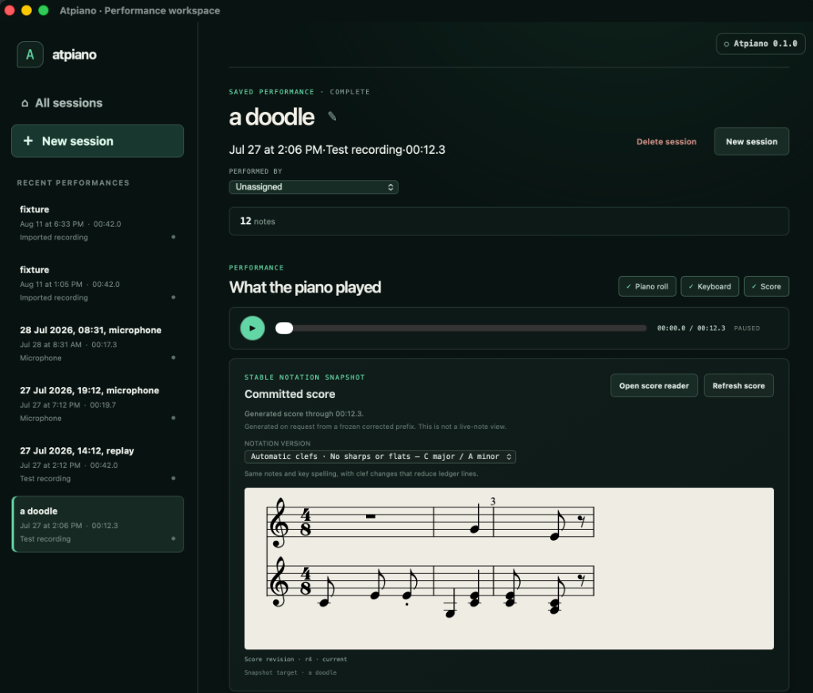

# Atpiano

Atpiano turns an acoustic-piano performance into a session you can listen to,
see, and revisit. Record from a nearby microphone or import an existing
recording, then review the detected notes alongside synchronized audio, a
piano roll, an 88-key keyboard, and optional sheet music.

## Download

[Download Atpiano for macOS or Windows](https://at-piano.com/download/).

> **macOS 0.1.1 users:** upgrade to 0.1.2 or later for microphone recording.
> The 0.1.1 hardened signature lacks the audio-input entitlement, although WAV
> and MP3 import remain available in that version.

The product homepage, hosted-version interest list, and privacy note live at
[at-piano.com](https://at-piano.com). Release checksums and updater artifacts
remain available on the
[GitHub Releases page](https://github.com/kzahel/atpiano/releases/latest).

The current proof-of-concept desktop applications support:

- macOS on Apple silicon, distributed as a signed and notarized DMG; and
- 64-bit Windows, distributed as a signed per-user installer.

Atpiano includes automatic update support. It runs locally and does not need a
source checkout or hosted account.

## What You Can Do

- Record a nearby acoustic piano through your computer's microphone.
- Import an existing WAV or MP3 piano recording.
- Listen to a performance while following its detected notes.
- Switch between piano-roll, keyboard, and generated-score views.
- Keep a library of named performances and return to them later.
- Export the recording, MIDI, event history, and available score artifacts.

## Getting Started

1. Open the [Releases page](https://github.com/kzahel/atpiano/releases/latest)
   and download the installer for your computer.
2. On macOS, open the DMG and copy Atpiano to Applications. On Windows, run
   the setup executable; administrator access is not required.
3. Open Atpiano and select **New session**.
4. Start the microphone and grant access when prompted, or import a recording.
5. Play, then select **Stop & settle** and allow the transcription to finish.
6. Use playback and the musical views to inspect the performance.

## Optional Sheet Music

Recording, playback, piano-roll, keyboard, and export features work without
the optional score model. If you enable sheet-music generation, Atpiano asks
for acknowledgement before downloading the model directly from its upstream
source.

That upstream repository and checkpoint currently have no explicit license
and are presented for education and research use only. They are not bundled
with Atpiano or its GitHub releases, and Atpiano does not grant rights to
them.

## Project Status

Atpiano is an early, free proof of concept. Acoustic transcription and
generated notation can make mistakes, so treat their output as a review aid
rather than an authoritative score. The source repository is public but does
not currently declare an Atpiano source license.

For current platform and release details, see the
[public desktop release topic](docs/topics/public-desktop-release.md).

## Documentation

- [Development guide](docs/development.md)
- [Architecture and technical contracts](docs/architecture.md)
- [Current topics and research status](docs/topics/README.md)
- [Implementation records](docs/tactical/README.md)
- [Desktop release operator runbook](docs/desktop-release-operator-runbook.md)
